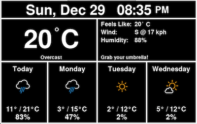
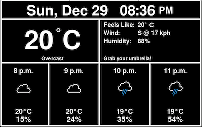
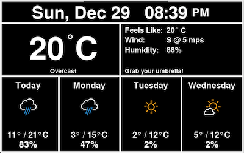
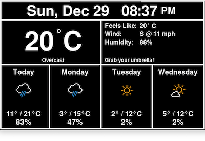
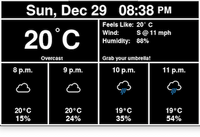

Dark Sky supports four sets of units for forecasts: `ca`, `si`, `uk2`, and `us`. The screenshots at the top of this page are with the units set to `us` in the config file. Below are screenshots of the other three:

| Units | Daily forecast                              | Hourly forecast                               |
|-------|---------------------------------------------|-----------------------------------------------|
| CA    |   |   |
| SI    |   |   |
| UK2   |  |  |
