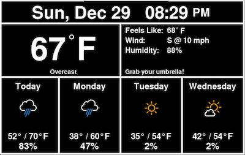
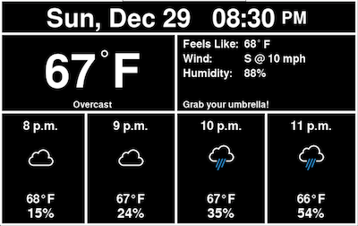
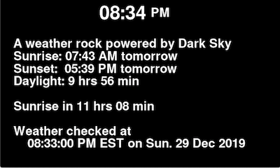

PiWeatherRock has three screens that it cycles through to show you a daily forecast, a hourly forecast, and an information screen. Here are examples of each:

| Daily forecast                                         | Hourly forecast                                          | Info screen                                 |
|--------------------------------------------------------|----------------------------------------------------------|---------------------------------------------|
|  |  |  |

Data for these forecasts is pulled from Dark Sky via their free API.

## Ready to get started?

Find out how to install PiWeatherRock in [Getting Started](getting-started/).
